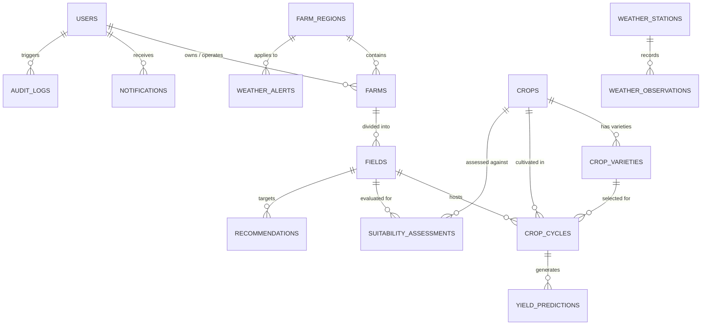

# Agricultural Yield Intelligence System (AYIS)
## Comprehensive System Architecture, User Personas & Operational Manual

> **Document Version:** 2.4.0  
> **Platform Classification:** Precision Agro-Intelligence & Decision Support Platform  
> **Runtime Architecture:** C# ASP.NET Core 8 Minimal API · MySQL 8 Spatial GIS Engine · Vanilla Web Interface  

---

## Table of Contents
1. [Executive Overview & Vision](#1-executive-overview--vision)
2. [End-to-End System Architecture](#2-end-to-end-system-architecture)
   - 2.1 The Three-Tier Architecture
   - 2.2 Data Ingestion & Storage Pipeline
   - 2.3 Agro-Climatic Intelligence Engine
3. [User Personas & Role-Based Access Control (RBAC)](#3-user-personas--role-based-access-control-rbac)
   - 3.1 Role Comparison Matrix
   - 3.2 Super Administrator (`super_admin`)
   - 3.3 System Administrator (`system_admin`)
   - 3.4 Agronomist (`agronomist`)
   - 3.5 Agricultural Extension Officer (`extension_officer`)
   - 3.6 Field Officer (`field_officer`)
   - 3.7 Weather / Climate Analyst (`weather_analyst`)
   - 3.8 Farm Manager (`farm_manager`)
   - 3.9 Smallholder Farmer (`farmer`)
4. [Domain Model & Database Engine](#4-domain-model--database-engine)
   - 4.1 Spatial Entity Relationships
   - 4.2 Geospatial Coordinate System (SRID 4326)
   - 4.3 Table Schema & Data Dictionary
5. [Core Operational Workflows (Step-by-Step)](#5-core-operational-workflows-step-by-step)
   - Workflow 1: Farmer Onboarding & Spatial Boundary Delineation
   - Workflow 2: Crop Cycle Initiation & Stage Progression
   - Workflow 3: Weather Observation Ingestion & Alert Dispatch
   - Workflow 4: Multi-Factor Crop Suitability Evaluation
   - Workflow 5: Predictive Yield Modeling & Confidence Bands
   - Workflow 6: Generating Agronomic Advisory Interventions
6. [API Subsystem & Integration Endpoints](#6-api-subsystem--integration-endpoints)
   - 6.1 Authentication & Security (BCrypt + JWT)
   - 6.2 Endpoint Reference Directory
7. [Frontend Architecture & Client State](#7-frontend-architecture--client-state)
   - 7.1 Vanilla JavaScript Design Principles
   - 7.2 The Dynamic Role Switcher & Hash Routing
   - 7.3 Hybrid Data Fetching (Live REST + Offline Resilience)
8. [Deployment, Administration & Troubleshooting](#8-deployment-administration--troubleshooting)
   - 8.1 Automated Single-Command Startup
   - 8.2 Self-Healing Port Conflicts
   - 8.3 Security Hardening & Production Checklist

---

## 1. Executive Overview & Vision

The **Agricultural Yield Intelligence System (AYIS)** is an enterprise-grade digital agriculture platform designed to bridge the data divide between high-level agronomic research and day-to-day farm management. 

Traditional agricultural operations suffer from fragmented decision-making: weather forecasts remain disconnected from soil moisture realities, crop variety selections ignore microclimate shifts, and smallholder farmers lack direct, timely advisory interventions. 

AYIS solves this by uniting:
- **Geographic Information Systems (GIS)**: Capturing precise farm borders and field topography using native MySQL 8 spatial polygons.
- **Microclimate Telemetry**: Ingesting live, historical, and forecasted ambient conditions from automated weather stations.
- **Scientific Phenology Models**: Tracking thermal thresholds (growing degree days), optimal precipitation ranges, and physiological crop stages.
- **Predictive Decision Support**: Calculating multi-variable suitability indices and machine-assisted yield forecasts to deliver clear, actionable recommendations.

---

## 2. End-to-End System Architecture

### 2.1 The Three-Tier Architecture

AYIS is built on strict separation of concerns, eliminating heavy framework runtimes to maximize throughput, minimize memory overhead, and ensure near-instant cold-start capabilities:

```
┌───────────────────────────────────────────────────────────────────────────┐
│                           PRESENTATION TIER                               │
│  Pure Vanilla Web (HTML5 · CSS3 Grid/Variables · ES6 JavaScript Modules)  │
│  - Zero npm dependencies · Zero React/Next.js/Node runtime overhead       │
│  - Dynamic Hash Router (#farms, #crops, #weather, #intelligence, etc.)    │
│  - Top Navbar Live Role Switcher (Simulates 8 distinct operational roles) │
└─────────────────────────────────────┬─────────────────────────────────────┘
                                      │ JSON REST over HTTP
                                      │ Bearer JWT Authentication
┌─────────────────────────────────────▼─────────────────────────────────────┐
│                            APPLICATION TIER                               │
│       C# ASP.NET Core 8 Minimal Web API (Native Kestrel Server)           │
│  - Dependency Injection container with Scoped Dapper Repositories         │
│  - Built-in Swagger / OpenAPI Documentation Engine (/swagger)             │
│  - BCrypt.Net-Next password hashing & HMAC-SHA256 JWT Token Generation     │
│  - Dynamic Port Conflict Resolver & Cross-Origin Resource Sharing (CORS)   │
└─────────────────────────────────────┬─────────────────────────────────────┘
                                      │ Connection Pooling
                                      │ Optimized SQL + Spatial Functions
┌─────────────────────────────────────▼─────────────────────────────────────┐
│                               DATA TIER                                   │
│            MySQL 8 Community Server (InnoDB Storage Engine)               │
│  - Native Spatial Columns: POINT & POLYGON with SRID 4326 (WGS 84)        │
│  - SPATIAL INDEX (R-Tree) for ultra-fast spatial containment queries      │
│  - Microsecond Temporal Precision (DATETIME(6)) for time-series weather   │
└───────────────────────────────────────────────────────────────────────────┘
```

### 2.2 Data Ingestion & Storage Pipeline

1. **Geospatial Ingestion**: When a farm or field is registered, spatial geometries are converted to Well-Known Text (WKT) format (`POINT(lon lat)` or `POLYGON((...))`) and stored via `ST_GeomFromText(..., 4326)`.
2. **Telemetry Ingestion**: Automated weather stations submit observations (air temperature, humidity, rainfall in mm, wind velocity, and solar radiation). Observations are cataloged against station coordinates and linked to spatial farm regions.
3. **Intelligence Calculation**: The calculation services query spatial boundaries, current weather accumulations, and crop requirements to derive mathematical suitability scores and yield estimates.

### 2.3 Agro-Climatic Intelligence Engine

The core intelligence engine uses a weighted heuristic algorithm balancing three primary dimensions:
$$\text{Suitability Score} = (w_T \times S_{\text{thermal}}) + (w_R \times S_{\text{rainfall}}) + (w_S \times S_{\text{soil}})$$

Where:
- $S_{\text{thermal}}$ evaluates deviation from the crop's optimal minimum and maximum temperatures.
- $S_{\text{rainfall}}$ scores cumulative precipitation against the water requirement for the specific phenological stage.
- $S_{\text{soil}}$ measures pH compatibility, drainage class, and soil organic matter percentage.

---

## 3. User Personas & Role-Based Access Control (RBAC)

AYIS provides 8 granular role profiles. Each persona has custom navigation, filtered domain actions, and dedicated dashboards.

### 3.1 Role Comparison Matrix

| Role | Badge | Key Responsibilities | Primary Routes |
| :--- | :--- | :--- | :--- |
| **Super Administrator** | `NATIONAL PLATFORM GOVERNANCE` | Global oversight, security posture, system config, regional risk analytics. | `#dashboard`, `#users`, `#system-configuration`, `#audit-logs` |
| **System Administrator** | `SYSTEM GOVERNANCE` | User lifecycle, server & database telemetry, audit inspection, role access control. | `#system-monitoring`, `#users`, `#roles`, `#audit-logs` |
| **Agronomist** | `AGRONOMIC INTELLIGENCE` | Crop catalog management, suitability algorithms, phenology models, advice approval. | `#crop-intelligence`, `#crop-suitability`, `#recommendations` |
| **Extension Officer** | `FIELD EXTENSION SERVICE` | Smallholder farmer onboarding, farm monitoring, scheduled visits, advisory broadcast. | `#farmers`, `#monitored-farms`, `#field-visits`, `#alerts` |
| **Field Officer** | `FIELD SCOUTING & INSPECTION` | Ground truth verification, boundary surveying, soil sampling, pest logging. | `#assigned-farms`, `#inspections`, `#observations`, `#tasks` |
| **Weather Analyst** | `AGROMETEOROLOGY COMMAND` | Weather station network, anomaly detection, extreme weather advisories, rainfall trends. | `#live-weather`, `#weather-trends`, `#weather-alerts`, `#data-quality` |
| **Farm Manager** | `ESTATE OPERATIONS & PRODUCTION`| Commercial farm management, field operations, input scheduling, yield forecasting. | `#my-farms`, `#fields`, `#cycles`, `#yield`, `#field-operations` |
| **Farmer** | `FARMER DECISION ASSISTANT` | Day-to-day plot monitoring, localized weather, daily tasks, crop alerts. | `#my-farms`, `#crops`, `#weather`, `#recommendations`, `#alerts` |

---

### 3.2 Super Administrator (`super_admin`)
- **Persona:** Chief Agrotechnology Officer / Ministry of Agriculture Directorate.
- **Core Purpose:** Holistic national platform governance, strategic food security tracking, and policy-level analytics.
- **Key Tasks:**
  1. Monitor aggregated production trends across all geographic counties (Nakuru, Uasin Gishu, Kiambu, etc.).
  2. Inspect high-level climate risk heatmaps and drought indices.
  3. Authorize high-privilege administrative accounts and global configuration overrides.
  4. Review system-wide audit logs to ensure compliance and data privacy standards.

### 3.3 System Administrator (`system_admin`)
- **Persona:** DevOps Engineer / Systems & Database Administrator.
- **Core Purpose:** Maintaining the operational health, security parameters, and data integrity of the infrastructure.
- **Key Tasks:**
  1. Inspect database connection pools, Kestrel web server status, and active API endpoints.
  2. Provision, activate, or revoke user accounts and assign security roles.
  3. Manage weather station metadata and API adapter integration keys.
  4. Run automated database backup routines and verify spatial index health.

### 3.4 Agronomist (`agronomist`)
- **Persona:** Dr. Sarah Mwangi — Senior Crop Intelligence Specialist (KALRO).
- **Core Purpose:** Defining biological crop parameters, calibrating yield models, and authoring research-backed advisory rules.
- **Key Tasks:**
  1. Maintain the master crop catalog (`crops`), defining thermal minimums, rainfall optimums, and growing days.
  2. Create hybrid variety profiles (`crop_varieties`) with disease resistance and drought tolerance flags.
  3. Calibrate multi-factor crop suitability algorithms for specific ecological zones.
  4. Formulate agronomic recommendation templates triggered by microclimate stress events.

### 3.5 Agricultural Extension Officer (`extension_officer`)
- **Persona:** Regional Field Extension Agent working with agricultural cooperatives.
- **Core Purpose:** Serving as the direct human link between intelligence systems and rural smallholder farming communities.
- **Key Tasks:**
  1. Register and onboard new smallholder farmers into the national registry.
  2. Schedule periodic in-person field extension visits and inspect compliance.
  3. Disseminate localized weather alerts, pest outbreaks (e.g., Fall Armyworm), and best practice advisories.
  4. Review farm-level yield forecasts to identify underperforming clusters requiring soil remediation.

### 3.6 Field Officer (`field_officer`)
- **Persona:** Ground Surveyor & Scouting Specialist.
- **Core Purpose:** Collecting ground-truth observations, GPS boundary vertices, and soil chemistry samples.
- **Key Tasks:**
  1. Map out farm and field boundaries using mobile GPS coordinate logging.
  2. Perform structured farm inspections scoring sanitation, pest pressure, and irrigation maintenance.
  3. Log real-time field observations with photographic evidence and severity ratings.
  4. Verify reported crop cycle milestones (emergence, flowering, physiological maturity).

### 3.7 Weather / Climate Analyst (`weather_analyst`)
- **Persona:** Agrometeorologist & Spatial Data Analyst.
- **Core Purpose:** Monitoring meteorological stations, verifying sensor accuracy, and identifying climate anomalies.
- **Key Tasks:**
  1. Monitor real-time telemetry streaming from regional weather stations.
  2. Detect sensory dropouts, anomalies, or precipitation calibration errors.
  3. Analyze 30-day moving average rainfall trends against 10-year historical baselines.
  4. Author and issue emergency weather alerts (Flash Flood, Severe Frost, Heatwave) targeted by region.

### 3.8 Farm Manager (`farm_manager`)
- **Persona:** Commercial Estate Operations Director (managing 20+ hectares).
- **Core Purpose:** Maximizing commercial farm throughput, organizing labor tasks, and minimizing input waste.
- **Key Tasks:**
  1. Divide registered farms into manageable parcels (`fields`) with specific soil pH and slope profiles.
  2. Initiate and track multi-season crop production cycles (`crop_cycles`).
  3. Monitor projected harvest dates, target yield benchmarks, and actual output variances.
  4. Dispatch daily field operation tasks (fertilizer top-dressing, weeding, drip irrigation runs).

### 3.9 Smallholder Farmer (`farmer`)
- **Persona:** John Kamau — Maize & Bean Producer.
- **Core Purpose:** Simple, high-impact daily farming assistant tailored for low-friction decision-making.
- **Key Tasks:**
  1. View a clear, high-contrast dashboard showing "What should I do today?".
  2. Check current weather conditions and 5-day rain probabilities before spraying or irrigating.
  3. Review tailored agronomic recommendations (e.g., "Top-dress with CAN fertilizer before Thursday's rain").
  4. Track current crop growth stages and receive harvest readiness reminders.

---

## 4. Domain Model & Database Engine

### 4.1 Spatial Entity Relationships



### 4.2 Geospatial Coordinate System (SRID 4326)

All spatial coordinates in AYIS use **WGS 84 (Spatial Reference System Identifier 4326)**, the international standard for GPS coordinates:
- `location`: Stored as `POINT(longitude latitude)`. Note: MySQL requires longitude (X) followed by latitude (Y).
- `boundary`: Stored as a closed polygon: `POLYGON((x1 y1, x2 y2, x3 y3, ..., x1 y1))`.
- **Spatial Indexes**: All spatial columns feature an InnoDB `SPATIAL INDEX` utilizing high-performance R-Trees for instantaneous spatial containment checks (`ST_Contains`, `ST_Distance_Sphere`).

### 4.3 Table Schema & Data Dictionary

| Table Name | Primary Key | Key Columns | Purpose |
| :--- | :--- | :--- | :--- |
| `users` | `id` (VARCHAR 36) | `username`, `email`, `password_hash`, `role`, `is_active` | System identities and RBAC authorization credentials. |
| `farm_regions` | `id` (VARCHAR 36) | `name`, `county`, `climate_zone` | Macro-geographical groupings for climate & extension zones. |
| `farms` | `id` (VARCHAR 36) | `name`, `owner_id`, `location` (POINT), `boundary` (POLYGON) | Legal agricultural holdings and estate boundaries. |
| `fields` | `id` (VARCHAR 36) | `farm_id`, `name`, `boundary` (POLYGON), `soil_ph`, `drainage` | Individual plots cultivated with specific varieties. |
| `crops` | `id` (VARCHAR 36) | `name`, `growing_days_typical`, `optimal_temp_min`, `rainfall_optimum_mm` | Master botanical catalog with bioclimatic requirements. |
| `crop_varieties`| `id` (VARCHAR 36) | `crop_id`, `name`, `maturity_days`, `drought_tolerance` | Specific commercial hybrids with resilience traits. |
| `crop_cycles` | `id` (VARCHAR 36) | `field_id`, `crop_id`, `start_date`, `status`, `stage` | Active season tracking from sowing to harvest. |
| `weather_stations`|`id` (VARCHAR 36)| `name`, `code`, `location` (POINT), `elevation_m` | Automated telemetry collection nodes. |
| `weather_observations`|`id` (BIGINT AUTO)| `station_id`, `timestamp`, `temperature_c`, `rainfall_mm` | High-frequency time-series weather readings. |
| `weather_alerts` | `id` (VARCHAR 36) | `region_id`, `severity`, `headline`, `effective_until` | Critical meteorological safety notifications. |
| `suitability_assessments`|`id` (VARCHAR 36)|`field_id`, `crop_id`, `suitability_score`, `limiting_factors` | Algorithmic suitability matching output. |
| `yield_predictions`|`id` (VARCHAR 36)| `cycle_id`, `predicted_yield_kg_ha`, `confidence_score_pct`| Statistical harvest forecast with bounds. |
| `recommendations` | `id` (VARCHAR 36) | `field_id`, `category`, `title`, `details`, `urgency` | Actionable agronomic instructions for operators. |
| `notifications` | `id` (VARCHAR 36) | `user_id`, `title`, `type`, `is_read` | User-facing messaging inbox. |
| `audit_logs` | `id` (BIGINT AUTO)| `user_id`, `action`, `resource_type`, `timestamp` | Tamper-evident compliance tracking. |

---

## 5. Core Operational Workflows (Step-by-Step)

### Workflow 1: Farmer Onboarding & Spatial Boundary Delineation
1. **Initiation**: Extension Officer or Administrator opens the top navbar and clicks **🌱 Onboard Farmer**.
2. **Personal Profile**: Enter Full Name, National ID / Tax Number, Phone Number, and Primary Region.
3. **Farm Coordinates**:
   - Provide the central GPS coordinates (Latitude & Longitude).
   - Draw or input the WKT polygon boundary vertices defining the perimeter.
4. **Soil & Infrastructure**: Select primary soil class (Volcanic Loam, Clay, Sandy Loam) and irrigation access (Rainfed, Drip, Sprinkler).
5. **System Creation**: 
   - Backend creates `users` record (role: `farmer`).
   - Inserts the `farms` record with spatial geometries.
   - Dispatches a welcome notification and provides temporary credentials.

### Workflow 2: Crop Cycle Initiation & Stage Progression
1. **Cycle Sowing**: Farm Manager or Farmer navigates to `#cycles` and selects **Start New Crop Cycle**.
2. **Plot Selection**: Choose a registered field parcel; the system automatically retrieves historic soil pH and drainage conditions.
3. **Cultivar Choice**: Select a crop (e.g., Maize) and hybrid variety (e.g., Highland Hybrid H614D).
4. **Schedule Generation**: The system projects key physiological dates based on the variety's `growing_days_typical`:
   - Emergence (Day 7-10)
   - Vegetative Surge (Day 25-35)
   - Flowering / Tasseling (Day 55-65)
   - Physiological Maturity (Day 105-120)
5. **Stage Progression**: As the season unfolds, Field Officers or Managers update the stage; the intelligence engine automatically adjusts water and nutrient demand models.

### Workflow 3: Weather Observation Ingestion & Alert Dispatch
1. **Observation Feed**: Automated ground stations send periodic sensor packets to `/api/v1/weather/recent`.
2. **Anomaly Check**: The weather engine compares received temperature and wind values against statistical standard deviations.
3. **Threshold Breaches**: If conditions meet severe criteria (e.g., Frost Warning: Temperature $< 2^\circ\text{C}$ for $> 3$ consecutive hours in a tea/maize region):
   - A `weather_alerts` entry is inserted with `CRITICAL` severity.
   - The notification dispatcher flags all farmers with active parcels inside the affected `farm_region`.
   - Alert banners appear in the top notification bell and dashboard viewports.

### Workflow 4: Multi-Factor Crop Suitability Evaluation
1. **Trigger**: Agronomist queries `#crop-suitability` for a specific plot before seasonal planting.
2. **Data Aggregation**:
   - Gathers field soil parameters ($\text{pH}$, slope %, drainage).
   - Ingests 3-year historical climate averages for the containing region (mean rainfall, minimum night temperatures).
   - Matches against the crop requirements table (`crops`).
3. **Classification**:
   - $\ge 85\%$: `HIGHLY_SUITABLE` (Optimal commercial recommendation).
   - $70\% - 84\%$: `MODERATELY_SUITABLE` (Good potential with minor amendments like liming).
   - $50\% - 69\%$: `MARGINALLY_SUITABLE` (High risk, requiring substantial artificial irrigation or soil buffering).
   - $< 50\%$: `NOT_SUITABLE` (Prohibited cultivation recommendation).

### Workflow 5: Predictive Yield Modeling & Confidence Bands
1. **Input Vectors**: Evaluates active `crop_cycles` along with cumulative vegetative growth degree days and actual recorded rainfall.
2. **Statistical Estimation**:
   $$\hat{Y} = Y_{\text{baseline}} \times \prod_{i} \text{StressFactor}_i$$
3. **Output Bands**:
   - Median Yield Estimate ($\text{kg/ha}$).
   - $95\%$ Confidence Interval Lower Bound ($\text{kg/ha}$).
   - $95\%$ Confidence Interval Upper Bound ($\text{kg/ha}$).
4. **Variance Feedback**: Compared against historical benchmarks to highlight positive yield trajectories or drought-induced reductions.

### Workflow 6: Generating Agronomic Advisory Interventions
1. **Rule Evaluation**: When an active cycle enters a water-sensitive window (e.g., Tasseling) and 7-day precipitation forecasts fall below $15\text{mm}$:
2. **Advisory Formulation**:
   - **Category**: `IRRIGATION`
   - **Urgency**: `HIGH`
   - **Title**: *Supplemental Drip Irrigation Required for Field A*
   - **Details**: *Moisture stress during tasseling can cause irreversible kernel abortion. Apply 30mm supplemental irrigation within 48 hours.*
3. **Delivery**: The recommendation appears in the Farmer's `#recommendations` panel with actionable completion buttons.

---

## 6. API Subsystem & Integration Endpoints

The backend is built with C# Minimal APIs, providing fast routing with minimal memory allocations.

### 6.1 Authentication & Security (BCrypt + JWT)
- **Password Security**: Passwords are saved as one-way salted hashes using BCrypt (`BCrypt.Net-Next`).
- **Token Format**: Standard JSON Web Tokens (HMAC-SHA256) containing claims:
  - `sub`: User ID
  - `unique_name`: Username
  - `email`: User Email
  - `role`: RBAC Role string (`super_admin`, `farmer`, etc.)
- **Authorization Header**: Client requests pass the token as `Authorization: Bearer <token>`.

### 6.2 Endpoint Reference Directory

```
HTTP METHOD   ROUTE                                  ACCESS LEVEL   DESCRIPTION
───────────────────────────────────────────────────────────────────────────────────────────────────
GET           /api/v1/health                         Public         Checks system & DB health
POST          /api/v1/auth/token                     Public         Login: returns JWT & user profile
GET           /api/v1/auth/me                        Authorized     Returns current authenticated user
GET           /api/v1/farms                          Public/User    Retrieves all farms with geometry
GET           /api/v1/farms/{id}                     Public/User    Retrieves specific farm details
GET           /api/v1/farms/{id}/fields              Public/User    Retrieves fields for a given farm
GET           /api/v1/crops                          Public         Lists all crops in the catalog
GET           /api/v1/crops/{id}                     Public         Detailed crop profile and varieties
GET           /api/v1/cycles                         Public/User    Lists crop production cycles
GET           /api/v1/weather/recent                 Public         Recent weather station readings
GET           /api/v1/intelligence/suitability       Public/User    Field suitability calculation
GET           /api/v1/intelligence/yield-predictions Public/User    Calculated yield projection
GET           /api/v1/recommendations                Public/User    Active agronomic advisories
GET           /api/v1/notifications                  Public/User    User notification list
```

---

## 7. Frontend Architecture & Client State

### 7.1 Vanilla JavaScript Design Principles
The frontend deliberately avoids heavy, rapidly shifting JavaScript frameworks (React, Next.js, Vue). 
- **Zero Build Step**: No `npm install`, Webpack, Vite, or bundle compilation is needed.
- **Fast Load Times**: Raw HTML5 and modular JavaScript load instantly in standard web browsers.
- **Native Web Standards**: Uses ES6 `import`/`export`, CSS Custom Properties (Variables), and CSS Grid.

### 7.2 The Dynamic Role Switcher & Hash Routing
The application acts as a Single-Page Application (SPA) driven by an internal router (`router.js`):
1. **Hash Routing**: Navigation uses standard URL hashes (`#dashboard`, `#farms`, `#weather`, `#crops`, `#recommendations`).
2. **Real-Time Role Simulation**: Selecting a role from the top dropdown instantly updates:
   - The user's title, subtitle, and avatar badge.
   - The navigation sidebar options (e.g., an Agronomist sees `#crop-suitability`, while a Farmer sees `#my-farms`).
   - The route protection whitelist, preventing unauthorized views.

### 7.3 Hybrid Data Fetching (Live REST + Offline Resilience)
The API service (`frontend/js/api.js`) implements a hybrid design:
- When the C# backend is reachable at `http://localhost:8000/api/v1`, live database queries are executed.
- If the backend is temporarily offline or undergoing migration, the client falls back to `DEMO_STATE` mock data, allowing UI workflows, testing, and presentations to continue without breaking.

---

## 8. Deployment, Administration & Troubleshooting

### 8.1 Automated Single-Command Startup

To boot the entire unified system:

**On Linux / macOS:**
```bash
./run.sh
```

**On Windows (PowerShell):**
```powershell
.\run.ps1
```

### 8.2 Self-Healing Port Conflicts

A common challenge in rapid development cycles is lingering processes locking ports (`8000` for backend or `8080` for frontend).

AYIS handles this with automated recovery:
- **Port Conflict Scanning**: Both `run-frontend.sh` and `run-backend.sh` check if the preferred port is open. If occupied, they automatically increment to the next free port (`8081`, `8082`, etc.).
- **Automatic Process Termination**: `run.sh` proactively frees ports `8000` and `8080` on launch and binds an exit trap (`trap cleanup SIGINT SIGTERM EXIT`) to terminate background tasks when you hit `Ctrl+C`.

### 8.3 Security Hardening & Production Checklist

Before promoting AYIS to public internet hosting:
1. **Secrets**: Update `Jwt:Key` in `appsettings.json` to a cryptographically random string (min. 64 characters) generated in an encrypted key vault.
2. **Database Credentials**: Replace MySQL `root` with a dedicated service account having scoped permissions:
   ```sql
   CREATE USER 'ayis_app'@'localhost' IDENTIFIED BY 'StrongRandomPassword123!';
   GRANT SELECT, INSERT, UPDATE, DELETE ON ayis_db.* TO 'ayis_app'@'localhost';
   FLUSH PRIVILEGES;
   ```
3. **Reverse Proxy & TLS**: Place ASP.NET Core Kestrel behind NGINX, Cloudflare, or Caddy with automated HTTPS certificates (Let's Encrypt).
4. **CORS Hardening**: Restrict `Cors:AllowedOrigins` in `appsettings.json` strictly to your production domain name instead of wildcards or development ports.

---

*Agricultural Yield Intelligence System (AYIS) — Built for sustainable, data-driven food security.*
